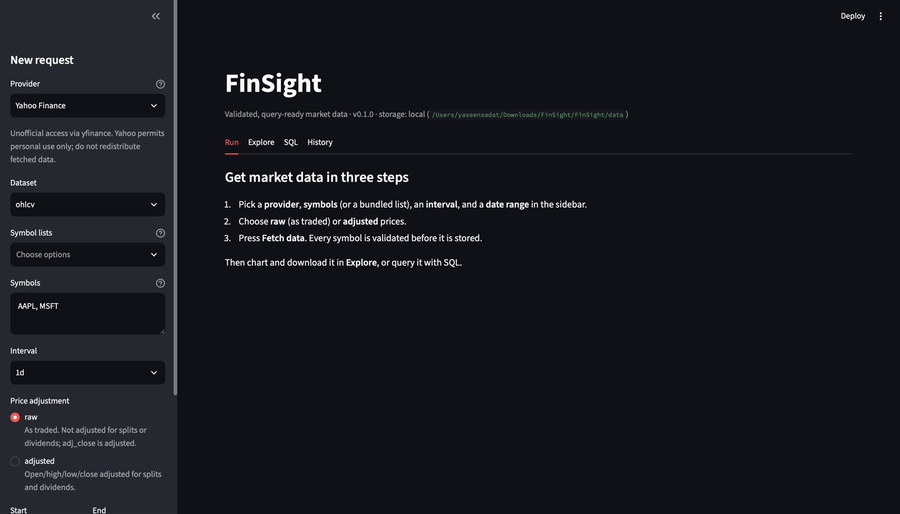
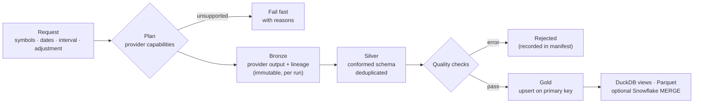

# FinSight

**Self-serve market data you can trust.** Request symbols, a date range, and an interval.
FinSight fetches the data, checks it against a schema and quality rules, and publishes it as
query-ready Parquet with a DuckDB catalog. Every run is reproducible and idempotent. It works on
your laptop with no cloud account and no infrastructure.

[](https://github.com/YaseenSadat/FinSight/actions/workflows/ci.yml)

[](LICENSE)

```console
$ finsight fetch AAPL MSFT NVDA --start 2020-01-01
$ finsight query "SELECT symbol, max(close) FROM ohlcv GROUP BY symbol"
```

FinSight is an **extensible foundation** for fetching market datasets reproducibly. Today it
ships **historical OHLCV price bars** from **Yahoo Finance**. The provider and dataset
abstractions are built so that more sources, and datasets such as dividends, splits, corporate
actions, and fundamentals, can be added without touching the pipeline. See
[What's supported](#whats-supported) and the [roadmap](#roadmap).

---

## Contents

- [Why FinSight](#why-finsight)
- [Option 1: Local quick start (no infrastructure)](#option-1-local-quick-start-no-infrastructure)
- [Option 2: Airflow platform](#option-2-airflow-platform)
- [What's supported](#whats-supported)
- [How it works](#how-it-works)
- [Using the data](#using-the-data)
- [CLI reference](#cli-reference)
- [Configuration](#configuration)
- [Project layout](#project-layout)
- [Extending FinSight](#extending-finsight)
- [Roadmap](#roadmap)
- [Data sources and terms of use](#data-sources-and-terms-of-use)
- [Development](#development)

## Why FinSight

Pulling prices into a notebook is easy. Keeping them correct, deduplicated, and reproducible
across hundreds of symbols and repeated runs is where ad-hoc scripts fall apart. FinSight does
that work for you:

- **Validated before it is stored.** Every symbol passes schema and quality checks (no null
  keys, no duplicate bars, positive prices, sane OHLC ranges, bars inside the requested window).
  Data that fails an error-level check never reaches the gold layer.
- **Idempotent.** Gold tables are upserted on a primary key, so re-running or overlapping
  requests never create duplicates.
- **Reproducible.** Each run writes a manifest with the exact request, library versions,
  per-symbol row counts, check results, and SHA-256 hashes of the files it produced.
- **Explicit about what is supported.** Providers declare their datasets, intervals, history
  limits, and adjustment modes. Unsupported requests fail immediately with a clear message,
  not with an empty file.
- **Raw or adjusted prices, your choice.** Get prices as traded (with `adj_close` alongside), or
  a series fully adjusted for splits and dividends.
- **Local-first, scales out when you need it.** Local Parquet + DuckDB by default. The same
  library also runs on S3/MinIO, with Airflow orchestration, a Spark engine, and an optional
  Snowflake sink.

## Option 1: Local quick start (no infrastructure)

This is the recommended way to use FinSight. You need Python 3.11+ and nothing else.

```bash
git clone https://github.com/YaseenSadat/FinSight.git
cd FinSight
python -m venv .venv && source .venv/bin/activate
pip install -e ".[ui]"        # drop [ui] if you only want the CLI and Python API
```

**Fetch data.** Symbols, a start date, and optionally an end date, interval, and adjustment:

```bash
finsight fetch AAPL MSFT BRK-B ^GSPC --start 2015-01-01
finsight fetch --universe dow30 --start 2024-01-01 --adjustment adjusted
finsight fetch TSLA --start 2026-09-01 --interval 5m
```

```console
$ finsight fetch AAPL MSFT BRK-B ^GSPC --start 2015-01-01
ohlcv · yahoo · 1d · raw · 2015-01-01 → 2026-09-29
┏━━━━━━━━┳━━━━━━━━━━━┳━━━━━━━┳━━━━━━━┳━━━━━━━━━┳━━━━━━━━━━━━━━━━━━━━━━━━━┓
┃ Symbol ┃ Status    ┃  Rows ┃   New ┃ Updated ┃ Coverage                ┃
┡━━━━━━━━╇━━━━━━━━━━━╇━━━━━━━╇━━━━━━━╇━━━━━━━━━╇━━━━━━━━━━━━━━━━━━━━━━━━━┩
│ AAPL   │ published │ 2,952 │ 2,952 │       0 │ 2015-01-02 → 2026-09-29 │
│ MSFT   │ published │ 2,952 │ 2,952 │       0 │ 2015-01-02 → 2026-09-29 │
│ BRK-B  │ published │ 2,952 │ 2,952 │       0 │ 2015-01-02 → 2026-09-29 │
│ ^GSPC  │ published │ 2,952 │ 2,952 │       0 │ 2015-01-02 → 2026-09-29 │
└────────┴───────────┴───────┴───────┴─────────┴─────────────────────────┘
Run 20260930T221109Z-a3265f succeeded (4 published)
```

**Query it** with SQL (DuckDB), from Python, or with any tool that reads Parquet:

```bash
finsight query "SELECT symbol, date, close FROM ohlcv WHERE symbol = 'AAPL' ORDER BY date DESC LIMIT 5"
finsight query "SELECT * FROM ohlcv" --format parquet --output prices.parquet
finsight catalog
```

```python
import finsight

run = finsight.fetch(["AAPL", "MSFT"], start="2020-01-01", adjustment="adjusted")
prices = finsight.load("ohlcv", symbols=["AAPL"], start="2024-01-01")
finsight.query("SELECT symbol, avg(volume) FROM ohlcv GROUP BY symbol")
```

**Use the web UI.** Pick symbols, dates, interval, and adjustment from menus, then chart, query,
and download the results:

```bash
finsight ui        # opens http://localhost:8501
```



**Try it offline.** The `synthetic` provider generates deterministic fake data with no network
access, which is useful for demos and development:

```bash
finsight fetch --universe mag7 --start 2024-01-01 --provider synthetic
```

Data lands in `./data` (configurable). See [Configuration](#configuration).

## Option 2: Airflow platform

For scheduled refreshes, a web-based orchestrator, S3-style object storage, or a Spark cluster,
FinSight includes a Docker Compose stack. It runs the **same library**: the DAGs are thin
wrappers around it.

| Service | URL | Notes |
|---|---|---|
| Airflow 3 | http://localhost:8080 | login `admin` / `admin` |
| MinIO (S3) | http://localhost:9001 | login from `.env` (default `finsight` / `finsight-secret`) |
| Spark master | http://localhost:8082 | only with `--profile spark` |

```bash
cp .env.example .env             # optional: change credentials
docker compose up -d             # Airflow + MinIO + Postgres
docker compose --profile spark up -d   # ...plus a Spark master and worker
```

Then in Airflow, trigger **`finsight_fetch`** with parameters (symbols, universe, dates,
interval, adjustment, engine, Snowflake load). **`finsight_daily`** refreshes a universe on
weekdays after the US close; it is paused until you enable it. No connections need to be
configured by hand.

Full guide: [docs/platform.md](docs/platform.md).

## What's supported

| Provider | Dataset | Intervals (history available) | Adjustments |
|---|---|---|---|
| `yahoo`: Yahoo Finance via [yfinance](https://github.com/ranaroussi/yfinance) | `ohlcv` | `1m` (last 29 days), `5m` `15m` `30m` (last 59 days), `1h` (last 729 days), `1d` `1wk` `1mo` (full history) | `raw`, `adjusted` |
| `synthetic`: offline generator, **not real data** | `ohlcv` | all of the above, any range | `raw`, `adjusted` |

- **Symbols** use Yahoo notation: equities and ETFs (`AAPL`, `BRK-B`), indices (`^GSPC`),
  currencies (`EURUSD=X`), futures (`ES=F`), crypto (`BTC-USD`), and international listings
  (`7203.T`).
- **Bundled universes:** `sp500`, `dow30`, `mag7`, `sector-etfs`, `index-etfs`
  (`finsight universes`).
- **Adjustment modes:**
  - `raw`: open/high/low/close/volume as traded. `adj_close` holds the split- and
    dividend-adjusted close.
  - `adjusted`: all prices adjusted for splits and dividends, for continuous return series.
  - Both modes can be stored side by side.

Run `finsight providers` for the live capability matrix.

## How it works



1. **Plan:** the request is validated and checked against the provider's declared capabilities.
2. **Ingest (bronze):** each symbol is fetched in parallel with retries for transient errors,
   checked against the dataset's provider contract, and written unchanged plus lineage columns.
3. **Transform (silver):** records are conformed: empty bars dropped, duplicates resolved to the
   latest fetch, and rows ordered. Runs on pandas by default or Spark on request.
4. **Publish (gold):** quality checks run per symbol. Passing data is merged into its gold
   partition, and a DuckDB catalog is refreshed.
5. **Manifest:** the run's full record is written to `runs/<run_id>.json`.

Failures are isolated per symbol. The run finishes with status `succeeded`, `partial`, or
`failed`, and the CLI exits `0`, `2`, or `1` accordingly.

Details: [docs/architecture.md](docs/architecture.md).

## Using the data

The `ohlcv` dataset (full contract in [docs/datasets.md](docs/datasets.md)):

| Column | Type | Description |
|---|---|---|
| `symbol` | string | Ticker in provider notation |
| `date` | date | Trading date in the exchange's timezone |
| `ts` | timestamp (UTC) | Bar start time |
| `open` `high` `low` `close` | double | Prices (raw or adjusted, see `adjustment`) |
| `adj_close` | double | Split- and dividend-adjusted close |
| `volume` | int64 | Volume |
| `interval` `adjustment` `provider` | string | Series identifiers |
| `run_id` `ingested_at` | string, timestamp | Lineage |

Primary key: `(provider, symbol, interval, adjustment, ts)`.

Local storage layout (`./data`):

```text
data/
├── bronze/ohlcv/<run>/<SYMBOL>.parquet          # immutable provider output, per run
├── silver/ohlcv/<run>/part-<SYMBOL>.parquet     # conformed, per run
├── gold/ohlcv/<provider>/<interval>/<adjustment>/<SYMBOL>.parquet   # e.g. gold/ohlcv/yahoo/1d/raw/AAPL.parquet
├── runs/<run>.json                              # run manifests
└── finsight.duckdb                              # views over gold, open with any DuckDB client
```

```bash
duckdb data/finsight.duckdb -c "SELECT * FROM ohlcv LIMIT 5"
```

```python
import pandas as pd

pd.read_parquet("data/gold/ohlcv")  # plain Parquet, readable by any engine
```

## CLI reference

| Command | Purpose |
|---|---|
| `finsight fetch SYMBOLS... --start DATE [--end] [--interval] [--adjustment] [--universe] [--provider] [--engine] [--json]` | Fetch, validate, and publish |
| `finsight query "SQL" [--format table\|csv\|json\|parquet] [--output FILE]` | Query gold data with DuckDB |
| `finsight catalog` | List stored series with coverage |
| `finsight runs list` / `finsight runs show [RUN_ID\|latest] [--json]` | Inspect run manifests and check results |
| `finsight providers` / `finsight datasets [NAME]` / `finsight universes [NAME]` | Discover what is supported |
| `finsight ui` | Launch the web UI |
| `finsight config` | Show resolved configuration (secrets masked) |
| `finsight storage init` | Create the data directory or bucket |
| `finsight snowflake sync [--run-id]` | MERGE a run's results into Snowflake |

`finsight COMMAND --help` documents every option.

## Configuration

FinSight works with zero configuration. To change behaviour, set environment variables or copy
[`.env.example`](.env.example) to `.env`:

| Variable | Default | Purpose |
|---|---|---|
| `FINSIGHT_DATA_DIR` | `./data` | Local data location |
| `FINSIGHT_STORAGE` | `local` | `local` or `s3` |
| `FINSIGHT_S3_BUCKET`, `FINSIGHT_S3_PREFIX`, `FINSIGHT_S3_ENDPOINT_URL` | | S3/MinIO location (`pip install "finsight[s3]"`) |
| `FINSIGHT_MAX_WORKERS` | `4` | Parallel symbol downloads |
| `FINSIGHT_MAX_RETRIES` | `3` | Retries for transient provider errors |
| `SNOWFLAKE_*` | | Optional Snowflake sink (`pip install "finsight[snowflake]"`) |

Full list: [docs/configuration.md](docs/configuration.md).

## Project layout

```text
src/finsight/
├── api.py            # fetch / load / query / catalog: the public Python API
├── cli.py            # `finsight` command-line interface
├── models.py         # FetchRequest, Interval, Adjustment
├── providers/        # Provider interface, registry, yahoo, synthetic
├── datasets/         # Dataset contracts (ohlcv) and registry
├── pipeline/         # bronze → silver → gold stages and run manifests
├── quality.py        # data quality check framework
├── storage.py        # local / S3 storage via fsspec, on-disk layout
├── warehouse/        # DuckDB views, Snowflake MERGE sink
├── engines/spark.py  # optional Spark engine for the transform stage
├── ui/app.py         # Streamlit web UI
└── universes/        # bundled symbol lists
platform/             # Option 2: Airflow image + DAGs, Spark jar bootstrap
docker-compose.yml    # Option 2 stack
docs/                 # architecture, datasets, providers, platform, configuration
tests/                # pytest suite (offline)
```

## Extending FinSight

- **Add a provider:** implement `Provider.capabilities` and `Provider.fetch`, then register it,
  or ship it as a separate package using the `finsight.providers` entry point.
- **Add a dataset:** define its schema, primary key, partitioning, conform step, and quality
  checks in a `Dataset` subclass.

Walkthrough with examples: [docs/providers.md](docs/providers.md).

## Roadmap

- [x] Historical OHLCV (intraday to monthly), raw and adjusted
- [x] Local Parquet + DuckDB, S3/MinIO, Airflow, Spark, Snowflake
- [ ] Dividends and splits datasets
- [ ] Corporate actions and symbol changes
- [ ] Fundamentals
- [ ] Additional providers (keyed APIs such as Tiingo, Alpha Vantage, Polygon)
- [ ] Incremental "fetch only what's missing" mode

Contributions are welcome. See [CONTRIBUTING.md](CONTRIBUTING.md).

## Data sources and terms of use

FinSight is software. It does **not** include or redistribute market data. When you run it, it
fetches data on your behalf from the provider you choose, and you are responsible for complying
with that provider's terms.

The default `yahoo` provider uses [yfinance](https://github.com/ranaroussi/yfinance), an
unofficial client that is not affiliated with Yahoo. Yahoo's terms permit **personal use
only**, so do not redistribute data obtained this way. Data may contain errors, and FinSight's
checks reduce but cannot eliminate them. Nothing here is investment advice.

## Development

```bash
make dev          # editable install with dev tools + pre-commit hooks
make test         # offline test suite
make lint typecheck
make test-all     # includes the Spark parity test (requires Java 17 or 21)
```

## License

[Apache License 2.0](LICENSE)
