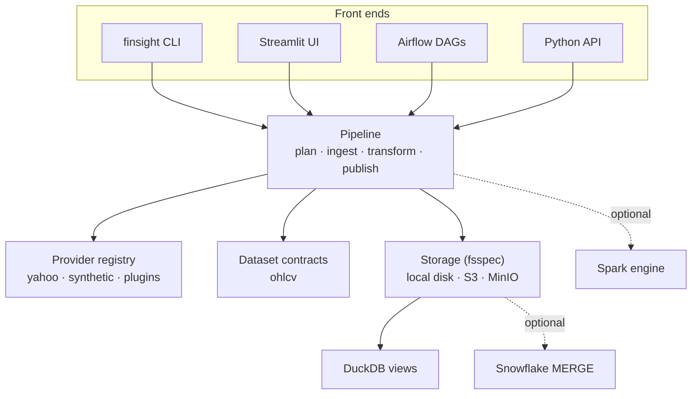

# Architecture

FinSight is a Python library with three front ends: the CLI, the Streamlit UI, and Airflow
DAGs. All three call the same `Pipeline`, so behaviour is identical however a run starts.

## Core concepts

| Concept | Module | Responsibility |
|---|---|---|
| `FetchRequest` | `finsight.models` | Normalised, validated request: dataset, provider, symbols, inclusive dates, interval, adjustment |
| `Provider` | `finsight.providers` | Adapts one upstream source. Declares capabilities; returns data in the dataset's provider contract |
| `Dataset` | `finsight.datasets` | Source-independent contract: provider schema, conformed schema, primary key, partitioning, conform step, quality checks |
| `Pipeline` | `finsight.pipeline` | Runs the stages, isolates per-symbol failures, writes the manifest |
| `Storage` / `Layout` | `finsight.storage` | fsspec filesystem rooted at the data location, plus path conventions. Directories use plain values, not `key=value`, and every column is stored in the files, so any Parquet reader can read them |
| `RunManifest` | `finsight.pipeline.manifest` | Audit record and the state passed between stages |

## Stages

### Plan

`FetchRequest.create` normalises input and collects **every** problem (bad symbols, bad dates,
unknown interval) into one `RequestError`. `Pipeline.plan` then asks the provider whether it
can serve the request: dataset, interval, adjustment, and history window (for example, Yahoo
5-minute bars only reach back 59 days). Nothing is fetched until the plan passes.

### Ingest → bronze

Symbols are fetched concurrently (`FINSIGHT_MAX_WORKERS`). Each outcome is recorded per symbol:

| Outcome | Status | Retried? |
|---|---|---|
| Data returned | `ingested` | – |
| Symbol exists, no bars in window | `no_data` | no |
| Unknown symbol | `not_found` | no |
| Rate limit, timeout, connection error | `failed` after retries | yes, exponential backoff (`FINSIGHT_MAX_RETRIES`) |
| Provider returned data that violates the contract | `failed` | no |
| Any other exception | `failed` | no (contained, never aborts the batch) |

Bronze files are immutable and keyed by run: `bronze/<dataset>/<run>/<SYMBOL>.parquet`.
They hold exactly what the provider returned, cast to the contract, plus lineage columns
(`symbol`, `provider`, request dimensions, `run_id`, `fetched_at`).

### Transform → silver

`Dataset.conform` drops rows with no prices, keeps the most recently fetched version of each
primary key, and orders the output. Silver is written per run to
`silver/<dataset>/<run>/`.

Two engines produce identical output. The Spark parity test compares them row for row.

- **pandas** (default): in-process, per symbol.
- **spark**: DataFrame API only (no Python UDFs), so executors need nothing but the JVM. Use
  it for large backfills on a cluster.

### Publish → gold

For each symbol, the dataset's quality checks run on the silver rows:

- **Error-level** failures (null keys, duplicate keys, non-positive prices, negative volume,
  bars outside the requested window) mark the symbol `rejected`. Nothing is written.
- **Warning-level** failures (high < low, open/close outside the high–low range) are recorded,
  and the data is still published.

Passing data is merged into its gold partition, one file per series
(`gold/ohlcv/<provider>/<interval>/<adjustment>/<SYMBOL>.parquet`): existing rows with
the same primary key are replaced, new rows are added, and the file is rewritten atomically on
local disk. The manifest records inserted and updated counts and the file's SHA-256.

For local storage, `data/finsight.duckdb` is refreshed with a view per dataset over the gold
Parquet files.

### Run status

| Status | Meaning | CLI exit code |
|---|---|---|
| `succeeded` | Every symbol was published or had no data | 0 |
| `partial` | Some symbols failed; others were delivered | 2 |
| `failed` | Nothing could be delivered | 1 |

## Stage independence

Stages share state only through storage and the manifest, which is saved after each stage.
Airflow therefore runs `ingest`, `transform`, and `publish` as separate tasks, and each can be
retried on its own:

- `transform` clears the run's silver directory before writing.
- `publish` upserts, so a retry has no additional effect.

## Reproducibility

A manifest (`runs/<run_id>.json`) contains:

- the normalised request
- the FinSight and provider-library versions
- the engine used
- per-stage timestamps
- for every symbol: status, message, retry attempts, bronze/silver/gold paths, row accounting
  (dropped and duplicate rows, inserted and updated rows), date coverage, every quality-check
  result, and the SHA-256 of the gold file written

Re-running the same request is safe, and the manifest shows exactly what changed.

## Concurrency

Gold partitions are written with read-merge-write. Run one writer per partition at a time: the
CLI and UI naturally do, and the Airflow DAGs cap concurrent runs. Two simultaneous runs that
touch the same symbol, interval, and adjustment could lose one run's updates.
